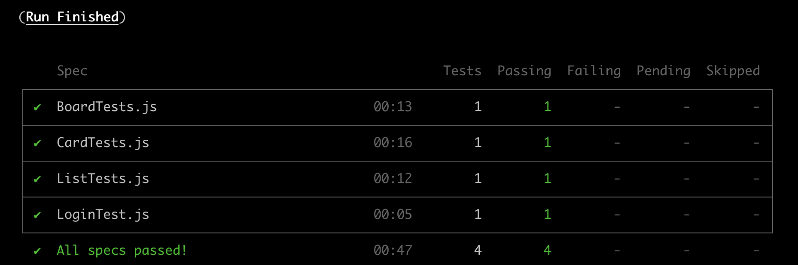

# Cypress Automation  

Cypress automation tests for the following scenarios:

1. Create Board
2. Create List
3. Craete Card
4. Add card description
5. Add card comment

Trello REST API is used to create and delete boards, create and archive lists in order to bring the system to the necessary state for each test suite.

### Test Report

### How to run

1. Create `cypress.env.json` as per the sample file (email and password for Trello, API key and token for Trello REST API)
2. `npm install`
3. `npm run cypress`
4. Run e2e tests on Chrome browser